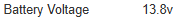

# Allsky MQTT Battery Monitor Service
Battery service is subscribe to a MQTT data channel that contains
data about the properties of a battery to post the data on the [Allsky](https://github.com/AllskyTeam/allsky) system page.

## Prequisites

[Allsky](https://github.com/AllskyTeam/allsky) running [RenogyMQTT](https://github.com/AeroSurvey/RenogyMQTT) powered by and connected to a Renogy Charge Controller.

## Displaying Battery Data
The battery data that is shown on the system page is the battery percent in a data type field then the battery percent with a progress type field.

Battery Voltage  


Battery Percent  


## Setup

SSH into the Raspberry Pi.

```bash
ssh <user>@<allsky hostname or IP>
```

Clone this repository.

```bash
git clone https://github.com/AeroSurvey/AllskyMQTTBatteryMonitor.git
```

Move into the AllskyMQTTBatteryMonitor folder.

```bash
cd AllskyMQTTBatteryMonitor
```

Copy the systemd example file, removing the `.example` extension.

```bash
sudo cp AllskyMQTTBatteryMonitor.service.example /etc/systemd/system/AllskyMQTTBatteryMonitor.service
```

Copy the StaticVars.txt file, removing the `.example` extension.

```bash
cp StaticVars.txt.example StaticVars.txt
```

Edit the systemd unit file with your specific parameters. All parameters that need modified are indicated with `<>`

```bash
sudo nano /etc/systemd/system/AllskyMQTTBatteryMonitor.service
```

Edit the StaticVar.txt file. All parameters that need modified are indicated with `<>`

```bash
nano StaticVars.txt
```

Reload systemd
```bash
sudo systemctl daemon-reload
```

Enable the service
```bash
sudo systemctl enable AllskyMQTTBatteryMonitor.service
```

Start the service
```bash
sudo systemctl start AllskyMQTTBatteryMonitor.service
```

Check the service status
```bash
sudo systemctl status AllskyMQTTBatteryMonitor.service
```

View logs
```bash
sudo journalctl -u AllskyMQTTBatteryMonitor.service -f
```

## Configuration within Allsky WebUI

TODO